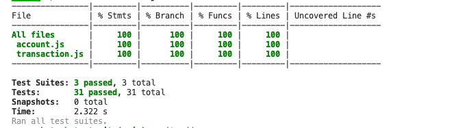

# Bank Tech Test

## Requirements

1. You should be able to interact with your code via a REPL like IRB or Node.
   (You don't need to implement a command line interface that takes input from STDIN.)

2. Deposits, withdrawal.

3. Account statement (date, amount, balance) printing.

4. Data can be kept in memory (it doesn't need to be stored to a database or anything).

---

## Acceptance Criteria

1. Given a client makes a deposit of 1000 on 10-01-2023
2. And a deposit of 2000 on 13-01-2023
3. And a withdrawal of 500 on 14-01-2023
4. When she prints her bank statement
5. Then she would see:

   date || credit || debit || balance\
   14/01/2023 || || 500.00 || 2500.00\
   13/01/2023 || 2000.00 || || 3000.00\
   10/01/2023 || 1000.00 || || 1000.00

---

## Diagramming and Planning

### Nouns

Date
Amount
Balance

### Verbs

Deposit(to add - credit)
Withdrawal (to subtract - withdrawal)

### Classes and Methods

```
class Transaction{
  costructor(){
    this.transaction = []
  }

  deposit(amount){
  if(inputCheck(amount))
    let credit = [date, amount, 0]
    adds to this.transaction
  else
    print error asking for integer as input
  }

  withdraw(amount) {
    if(inputCheck(amount))
      let debit = [date, 0, amount]
      adds to this.transaction
    else
      print error asking for integer as input
  }

  inputCheck(userInput){
    checks user input is a number
      returns true
    else returns error message
      "Please enter a number"
  }
}

class Account{
  constructor(startingBalance){
    this.currentBalance = startingBalance
    this.transactionHistory = []
  }

  recordTransaction(transaction){
    checks if its debit/credit
    if debit
      if(this.#minimumFunds(transaction))
        this.transactionHistory.unshift([date, amount, 0, this.currentBalance -= amount])
    else credit
      this.transactionHistory.unshift([date, amount, 0, this.currentBalance += amount])
  }

  printTransactions() {
    prints this.balance in required
    "date || credit || debit || balance"
    credit - - -
    debit - - -
  }

  #minimumFunds(transaction){
    if currentBalance will drop below 0 withdrawal get rejected
  }
}
```

---

### Edge Cases

- User cannot withdraw balance below £0 needs to be checked in withdraw method
- User should only be able to enter a number cannot accept strings. Could have another method to house this as it will need to be called within deposit and withdraw

## To run the programme

### Running the programme

1. Clone this repoistory to your local work area.
2. Run the following to setup the environment, use node and install jest

```
# Setup our environment to use node latest version
$ nvm use node

# Create the project directory
$ mkdir my-project
$ cd my-project

# Initialise the NPM project (this will create a file package.json)
$ npm init -y

# Add the jest package to our project
# (this will update package.json and package-lock.json)
$ npm add jest

# Also install jest "globally"
# (this is so we can run the `jest` command)
$ npm install -g jest

# Run our tests
$ jest

```

3. Below is an example of how you can run the programme yourself using node. First of all you require in the files. Then for example, for each transaction, a withdrawal or deposit,
   you want to make you will need to create a new instance of Transaction. If you want to process this transaction you need to record it into the account by passing it as an argument into account.recordTransaction(). This will make sure that for a withdrawal you have enough funds and record all transactions in reverse chronological order.

When printStatement() is called you get the specified output as exampled in the results directory in this repository.

```
const Transaction = require('./lib/transaction.js')
const Account = require('./lib/account.js')
const account = new Account(0)
const transaction1 = new Transaction
const transaction2 = new Transaction

account.recordTransaction(transaction1.deposit(100))
account.recordTransaction(transaction2.withdrawal(50))
account.printStatement()
```

### Testing

If you want to jest test this programme yourself navigate to the parent directory and run 'jest --coverage' in the terminal.

Test coverage is 100% for a total of 31 tests, across 3 test suites. A screenshot of this is in the results file.

The mock tests with the account.test.js demonstrate the programme displaying transactions with the most recent being first.

For the integration tests where the methods are called, not their mock counter parts, I have created a dateFormatter method.

This is to ensure that when the test is run and a new transation is created at that moment in time, the test will have
the correct expectation, rather than an outdated date.


